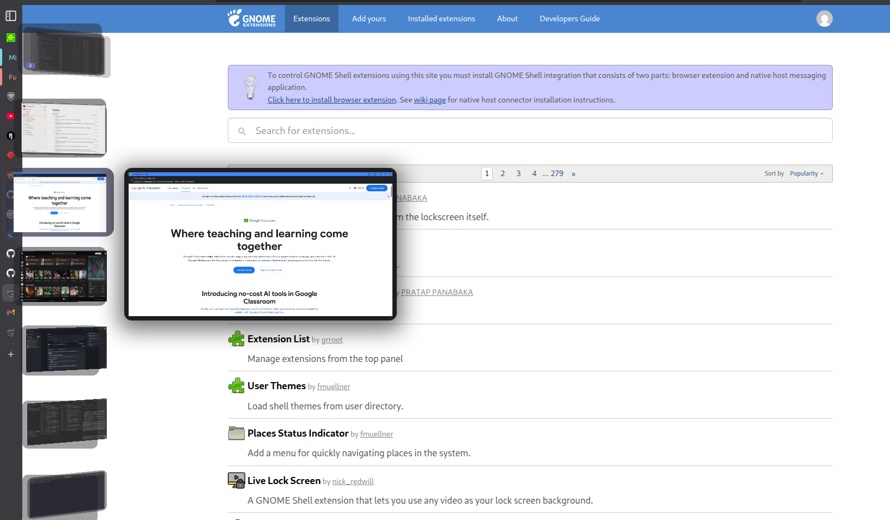
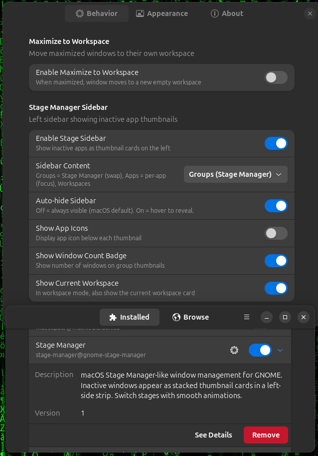
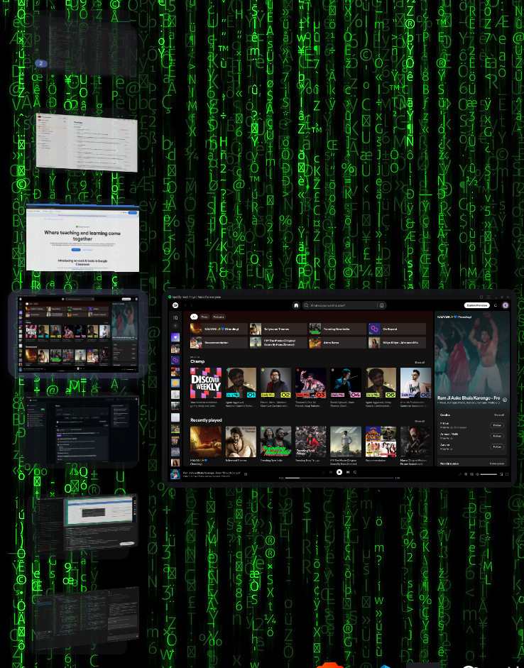

# Stage Manager for GNOME

A macOS Stage Manager-like window management extension for GNOME Shell.

Group windows into stages — only one group is visible at a time, others appear as stacked thumbnail cards in a left sidebar. Click a card to swap stages. Supports per-app mode, workspace mode, bell-curve hover animations, and 3D perspective.



## Features

- **Stage Manager Groups** — Windows you use together stay grouped. Only the active group is visible; inactive groups appear as stacked thumbnail cards in a left sidebar.
- **One-Click Swap** — Click any sidebar card to swap stages: the active group minimizes, the clicked group comes to the foreground.
- **3 Sidebar Modes** — Groups (Stage Manager swap), Apps (per-app focus), Workspaces (switch workspaces).
- **Maximize to Workspace** — Optionally move maximized windows to their own workspace (disabled by default).
- **Bell-Curve Hover Animation** — Hovered card scales up smoothly; only 1-2 neighbors are affected (tight sigma).
- **3D Perspective** — Cards have a configurable Y-axis rotation for a natural depth look, consistent direction for all cards.
- **Stacked Thumbnails** — Groups with multiple windows show fanned-out card stacks with visible back layers.
- **Window Count Badge** — Optional badge showing how many windows are in each group.
- **Live Previews** — Hover a card to see a larger preview of all windows in the group, tiled vertically.
- **Icon Fallback** — Minimized windows that can't be cloned show app icon grids instead.
- **Transparent Sidebar** — No dark bar; each card has its own frosted-glass pill background.
- **Auto-hide** — Off by default (macOS behavior: always visible). Toggle on for hover-to-reveal.
- **Fullscreen Aware** — Sidebar hides instantly when any window goes fullscreen.
- **App Icons** — Each card shows app icons below the thumbnail.
- **Configurable** — Sidebar width, animation speed, perspective angle, card scale, auto-hide delay, and more.



## Screenshots

<!-- Add your screenshots here -->
<!-- 
 -->

## Requirements

- GNOME Shell 45, 46, 47, or 48
- Wayland or X11

## Installation

### From GNOME Extensions

1. Visit [extensions.gnome.org](https://extensions.gnome.org/) and search for **Stage Manager**
2. Toggle the switch to install

### From Extension Manager App

1. Open **Extension Manager** (install from Flathub if needed)
2. Search for "Stage Manager"
3. Click Install

### From Zip File

```bash
make pack
gnome-extensions install dist/stage-manager@gnome-stage-manager.shell-extension.zip
```

Then **log out and log back in** (required on Wayland).

### From Source

```bash
git clone https://github.com/itsdigvijaysing/gnome-stage-manager.git
cd gnome-stage-manager
make install
```

Then **log out and log back in** (required on Wayland).

### Enable the Extension

```bash
gnome-extensions enable stage-manager@gnome-stage-manager
```

Or use the **Extension Manager** app to toggle it on.

## Configuration

Open preferences via:

```bash
gnome-extensions prefs stage-manager@gnome-stage-manager
```

Or click the gear icon in Extension Manager.

### Behavior

| Setting | Default | Description |
|---------|---------|-------------|
| Enable Maximize to Workspace | Off | Maximized windows get their own workspace |
| Enable Stage Sidebar | On | Show the left-side sidebar |
| Sidebar Content | Groups | Groups (Stage Manager), Apps (per-app focus), or Workspaces |
| Auto-hide Sidebar | Off | Off = always visible (macOS default). On = hover to reveal |
| Show App Icons | On | Display app icons below thumbnails |
| Show Window Count Badge | On | Show number of windows on group thumbnails |
| Show Current Workspace | On | In workspace mode, also show the current workspace card |

### Appearance

| Setting | Default | Range | Description |
|---------|---------|-------|-------------|
| Sidebar Width | 220px | 120-400 | Width of the sidebar |
| Edge Trigger Width | 4px | 1-20 | Hot zone at screen edge (pixels) |
| Card Base Scale | 70% | 40-100 | Default card size percentage |
| Perspective Angle | 22° | 0-45 | 3D Y-axis rotation (0 = flat) |
| Animation Duration | 250ms | 0-1000 | Slide animation speed |
| Hide Delay | 800ms | 100-5000 | Delay before hiding after mouse leaves |

## How It Works

### Groups Mode (default)

1. All visible windows on the current workspace form the **active group**.
2. When you manually minimize a window, it splits into its own **inactive group** in the sidebar.
3. Click a sidebar card to **swap**: the active group minimizes, the target group unminimizes and comes to the foreground.
4. New windows automatically join the active group.

### Apps Mode

Windows are grouped by application. Click a sidebar card to focus that app's windows.

### Workspaces Mode

Each workspace is shown as a sidebar card. Click to switch workspaces.

## Debugging

Check extension logs:

```bash
journalctl --user -b -g stage-manager
```

Or use the **About** tab in the extension preferences, which has a built-in log viewer.

## Uninstall

```bash
make uninstall
```

Or disable/remove via Extension Manager.

## License

GPL-3.0-or-later. See [LICENSE](LICENSE).
